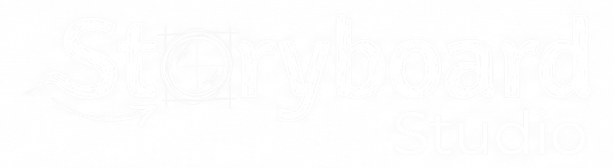

<div align="center">
  

  # AI Video Studio

  ### Transform Your Stories into Stunning Videos with AI

  [](https://nextjs.org/)
  [](https://www.typescriptlang.org/)
  [](https://tailwindcss.com/)
  [](LICENSE)

  <p align="center">
    <a href="#features">Features</a> •
    <a href="#demo">Demo</a> •
    <a href="#quick-start">Quick Start</a> •
    <a href="#usage">Usage</a> •
    <a href="#tech-stack">Tech Stack</a>
  </p>
</div>

---

## ✨ Features

<table>
  <tr>
    <td width="50%">
      <h3>🎬 Image to Video</h3>
      <p>Upload images and transform them into professional videos with AI-powered motion generation. Add camera movements, adjust aspect ratios, and create cinematic experiences.</p>
    </td>
    <td width="50%">
      <h3>📖 AI Story Generation</h3>
      <p>Automatically analyze stories, generate complete storyboards, and produce videos. Perfect for content creators, filmmakers, and storytellers.</p>
    </td>
  </tr>
  <tr>
    <td width="50%">
      <h3>🎨 Character Consistency</h3>
      <p>Upload character reference images and maintain visual consistency across all generated scenes using advanced image-to-image AI technology.</p>
    </td>
    <td width="50%">
      <h3>📱 Mobile Optimized</h3>
      <p>Fully responsive design with mobile-first approach. Add to home screen for a native app experience on any device.</p>
    </td>
  </tr>
</table>

### 🚀 Key Capabilities

- **Multiple Video Models**: Support for Sora 2, Veo 3.1, and more cutting-edge AI video models
- **Flexible Aspect Ratios**: 16:9 landscape, 9:16 portrait, and 1:1 square formats
- **Advanced Camera Controls**: Professional camera movements including pan, tilt, zoom, and dolly
- **Real-time Progress**: Live status updates during image and video generation
- **Batch Processing**: Generate multiple storyboard scenes simultaneously
- **Project Management**: Save, load, and export your projects with ease

---

## 🎥 Demo

### Animated Story Examples

<div align="center">
  
  
  <p><em>AI-generated animated storyboard sequences with character consistency</em></p>
</div>

### Realistic Style Examples

<div align="center">
  
  
  <p><em>Photorealistic video generation with cinematic camera movements</em></p>
</div>

---

## 🚀 Quick Start

### Prerequisites

- Node.js 18+ installed
- APIMart API Key ([Get one here](https://apimart.ai/))
- Cloudinary account for image hosting ([Sign up](https://cloudinary.com/))

### Installation

```bash
# Clone the repository
git clone https://github.com/lupus8023/aid.git
cd aid

# Install dependencies
npm install

# Set up environment variables
cp .env.local.example .env.local
```

### Configuration

Edit `.env.local` and add your API keys:

```env
# APIMart API Key (required)
APIMART_API_KEY=your_apimart_key_here

# Cloudinary Configuration (required for image uploads)
CLOUDINARY_CLOUD_NAME=your_cloud_name
CLOUDINARY_API_KEY=your_cloudinary_key
CLOUDINARY_API_SECRET=your_cloudinary_secret
```

### Run Development Server

```bash
npm run dev
```

Open [http://localhost:3000](http://localhost:3000) in your browser.

### Build for Production

```bash
npm run build
npm start
```

---

## 📖 Usage

### Image to Video Mode

1. **Upload Images**
   - Upload your first frame image (required)
   - Optionally upload a last frame image for controlled motion
   - Image size must be under 6MB

2. **Configure Settings**
   - Select aspect ratio (16:9, 9:16, or 1:1)
   - Choose camera movements (pan, tilt, zoom, dolly, etc.)
   - Write motion description

3. **Generate Video**
   - Click "Generate Video" button
   - Wait for AI processing (typically 1-3 minutes)
   - Download or regenerate as needed

### AI Story Generation Mode

1. **Setup Characters & Objects**
   - Add character names and upload reference images
   - Add objects with descriptions (optional)
   - Upload your story file (Markdown or text)

2. **Generate Outline**
   - AI analyzes your story structure
   - Review and edit the generated outline
   - Proceed to scene breakdown

3. **Create Storyboards**
   - AI splits story into individual scenes
   - Each scene includes characters, description, and prompt
   - Review and edit scene details

4. **Render Images & Videos**
   - Generate images for all storyboard scenes
   - Convert images to videos with motion
   - Download individual scenes or export entire project

---

## 🛠️ Tech Stack

### Frontend
- **[Next.js 15](https://nextjs.org/)** - React framework with App Router
- **[React 18](https://react.dev/)** - UI library
- **[TypeScript](https://www.typescriptlang.org/)** - Type safety
- **[Tailwind CSS](https://tailwindcss.com/)** - Utility-first styling
- **[Lucide React](https://lucide.dev/)** - Beautiful icons

### Backend & APIs
- **[APIMart AI](https://apimart.ai/)** - AI video and image generation
- **[Cloudinary](https://cloudinary.com/)** - Image hosting and CDN
- **Next.js API Routes** - Serverless functions

### AI Models
- **Sora 2** - OpenAI's video generation model
- **Veo 3.1** - Google's advanced video model
- **Doubao SeeDream 5.0** - ByteDance's image generation
- **Gemini 3 Pro** - Google's multimodal AI

---

## 📁 Project Structure

```
aid/
├── app/
│   ├── api/                    # API routes
│   │   ├── analyze/           # Story analysis
│   │   ├── generate/          # Image generation
│   │   ├── generate-video/    # Video generation
│   │   ├── check-image-status/
│   │   └── check-video-status/
│   ├── image-to-video/        # Image to video page
│   ├── story/                 # Story generation page
│   ├── globals.css
│   ├── layout.tsx
│   └── page.tsx               # Home page
├── components/                 # React components
├── lib/                       # Utilities and helpers
├── types/                     # TypeScript definitions
└── public/                    # Static assets
```

---

## 💡 Tips & Best Practices

- **Image Quality**: Use high-resolution images (at least 1024px) for best results
- **Character Consistency**: Upload clear, well-lit reference images with consistent angles
- **Story Structure**: Write clear, descriptive scenes with specific visual details
- **Aspect Ratios**: Note that 1:1 square format is not supported by Veo models
- **Generation Time**: Video generation typically takes 1-3 minutes per scene
- **API Costs**: Monitor your APIMart usage to manage costs effectively

---

## 🤝 Contributing

Contributions are welcome! Please feel free to submit a Pull Request.

1. Fork the repository
2. Create your feature branch (`git checkout -b feature/AmazingFeature`)
3. Commit your changes (`git commit -m 'Add some AmazingFeature'`)
4. Push to the branch (`git push origin feature/AmazingFeature`)
5. Open a Pull Request

---

## 📄 License

This project is licensed under the MIT License - see the [LICENSE](LICENSE) file for details.

---

## 🙏 Acknowledgments

- [APIMart AI](https://apimart.ai/) for providing powerful AI APIs
- [Cloudinary](https://cloudinary.com/) for image hosting infrastructure
- [Next.js](https://nextjs.org/) team for the amazing framework
- All contributors and users of this project

---

## 📧 Contact & Support

- **Issues**: [GitHub Issues](https://github.com/lupus8023/aid/issues)
- **Discussions**: [GitHub Discussions](https://github.com/lupus8023/aid/discussions)

---

<div align="center">
  <p>Made with ❤️ by the AI Video Studio team</p>
  <p>
    <a href="#top">Back to Top ↑</a>
  </p>
</div>
